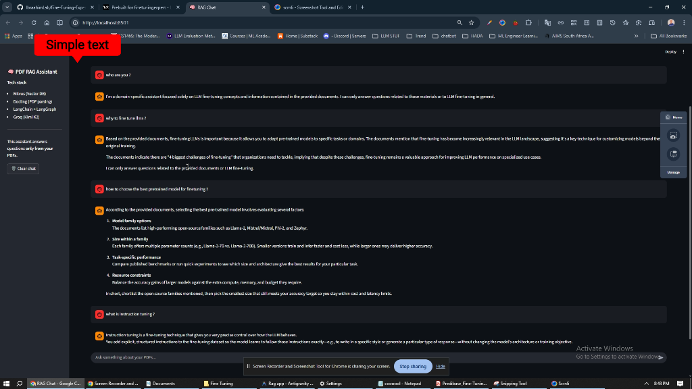
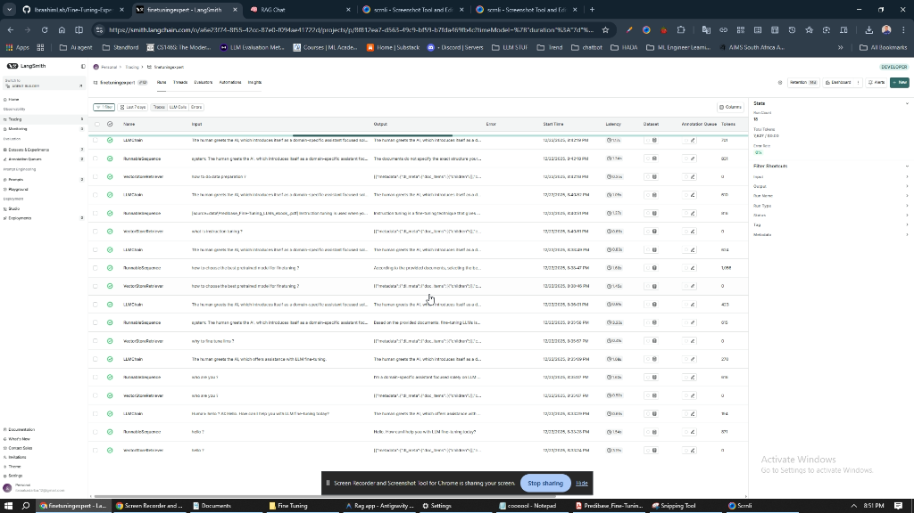
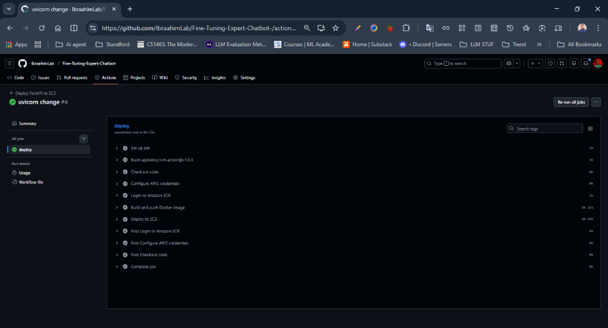
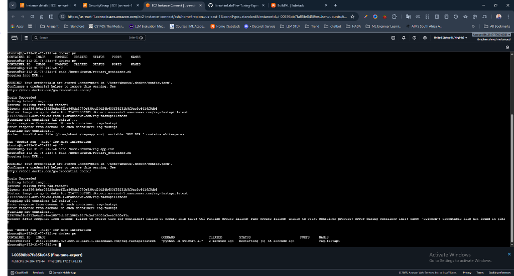

# Fine-tuning Expert Chatbot

An advanced Retrieval-Augmented Generation (RAG) assistant designed to provide expert knowledge on fine-tuning Large Language Models (LLMs). This project utilizes a specialized **Fine-tuning Book Knowledge Base** to answer complex questions with precision and context.

Built with a modern stack including **Milvus**, **Docling**, **LangChain**, **LangGraph**, and **FastAPI**, with a **Streamlit** user interface.



## 🚀 Features

- **Expert Knowledge Base**: Ingests and retrieves information from dedicated fine-tuning resources (PDFs).
- **Advanced Ingestion**: Uses **Docling** for robust PDF parsing and **Sentence Transformers** for high-quality embeddings.
- **Vector Search**: **Milvus** vector database for efficient and scalable similarity search.
- **Intelligent Reasoning**: Powered by **Groq** (using models like `kimi-k2-instruct`) for fast and accurate response generation.
- **Observability**: **LangSmith** integration for tracing and monitoring LLM interactions.
- **Safety**: **Prompt Guardrails** to ensure relevant and safe responses.
- **Interactive UI**: User-friendly chat interface built with **Streamlit**.
- **API First**: Robust **FastAPI** backend for scalable serving.

## 🛠️ Tech Stack

- **Language**: Python 3.11+
- **Frameworks**: FastAPI, Streamlit, LangChain, LangGraph
- **Vector DB**: Milvus (or Zilliz Cloud)
- **PDF Parsing**: Docling
- **LLM Provider**: Groq
- **Embeddings**: Hugging Face (Sentence Transformers)
- **Observability**: LangSmith
- **Dependency Management**: uv

## 🔍 Observability with LangSmith

This project is integrated with **LangSmith** to provide deep visibility into the RAG pipeline. You can trace every step of the answer generation process, from retrieval to final response.



## 🛡️ Prompt Guardrails

To ensure the chatbot stays focused and helpful, we implement prompt guardrails:
- **System Prompts**: strict instructions to only answer based on the provided fine-tuning materials.
- **Topic Filtering**: (Implicit in design) The model is guided to decline answering questions unrelated to the knowledge base.

## 📋 Prerequisites

- **Python 3.11** or higher
- **uv** (recommended for fast dependency management)
- **Milvus** instance (local file, Docker, or Zilliz Cloud)
- **Groq API Key**
- **LangSmith API Key** (optional, recommended for debugging)

## ⚡ Installation

### 1. Clone the Repository
```bash
git clone <repository-url>
cd "Rag app"
```

### 2. Install Dependencies
This project uses `uv` for package management.
```bash
# Install uv if you haven't already
pip install uv

# Sync dependencies
uv sync
```

### 3. Configure Environment Variables
Copy the example environment file and fill in your credentials.
```bash
cp .env.example .env
```
Open `.env` and set your API keys.

#### Key Environment Variables
- `GROQ_API_KEY`: For LLM access.
- `MILVUS_URI`: Path or URI to your Milvus instance.
- `LANGCHAIN_TRACING_V2`: Set to `true` to enable LangSmith.
- `LANGCHAIN_API_KEY`: Your LangSmith project API key.

## 📖 Usage

### 1. Ingest Data
First, place your fine-tuning PDF books into the `data/pdfs` directory. Then run the ingestion script to parse and index them into Milvus.
```bash
# Place PDFs in ./data/pdfs/ first!
uv run python -m scripts.ingest
```

### 2. Run the Backend API
Start the FastAPI server to handle query requests.
```bash
uv run uvicorn app.api.main:app --reload --port 8000
```
- API Docs: [http://localhost:8000/docs](http://localhost:8000/docs)
- Health Check: [http://localhost:8000/health](http://localhost:8000/health)

### 3. Run the Chat Interface
Launch the Streamlit app to interact with the chatbot.
```bash
uv run streamlit run app/ui/streamlit_app.py
```
The UI will run at [http://localhost:8501](http://localhost:8501).

## 🐳 Docker Support & Deployment

The application is containerized and can be deployed via Docker or CI/CD pipelines (e.g., GitHub Actions to EC2).

### Build and Run Streamlit UI
```bash
cd docker/streamlit
docker build -t rag-app-ui .
docker run -p 8501:8501 --env-file ../../.env rag-app-ui
```

### CI/CD Pipeline
We use GitHub Actions for automated deployment to AWS EC2.




## 📂 Project Structure

```
Rag app/
├── app/
│   ├── api/            # FastAPI routes and server
│   ├── core/           # Configuration and core logic (LLM, Embeddings)
│   ├── ingestion/      # PDF parsing and chunking logic
│   ├── rag/            # Retrieval and generation chains
│   └── ui/             # Streamlit frontend
├── data/
│   └── pdfs/           # Directory for knowledge base PDFs
├── docker/             # Dockerfiles
├── images/             # Documentation images
├── scripts/
│   └── ingest.py       # Data ingestion script
├── .env.example        # Environment variable template
├── pyproject.toml      # Python dependencies
└── README.md           # Project documentation
```

## 📜 License

[MIT License](LICENSE)